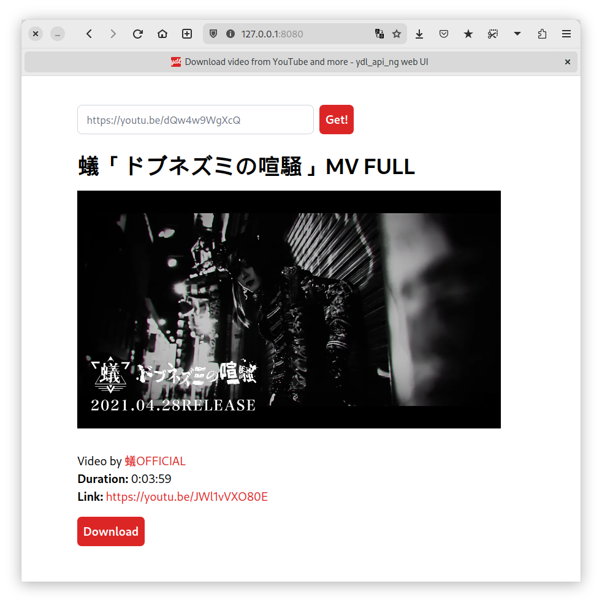
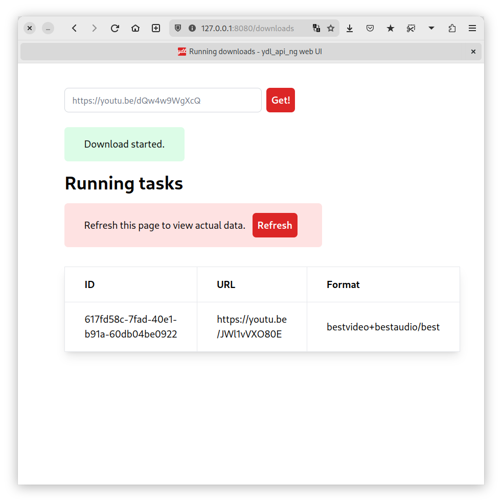

# ydl_api_ng Web UI

This is a shitty Web UI for [ydl_api_ng](https://github.com/Totonyus/ydl_api_ng) — API around [yt-dlp](https://github.com/yt-dlp/yt-dlp).




This UI is written for my personal use and may not have the features you would like to see. I want to gradually expand its capabilities, if there is time for this.

# Roadmap

- [] Handle non-youtube links
- [] Handle unsupported URLs
- [] Advanced settings
- [] Direct link to downloaded video

# Installation

I recomment setup with Docker via [docker-compose.yml](docker-compose.yml).

# Development

Web UI is written on Python in backend and Tailwind CSS for UI.

## Frontend

[Install Node.js](https://github.com/nvm-sh/nvm) and run in project dir:

```
npm install --dev
```

Run Tailwind CSS CLI for autorebuilding style.css:

```
make css
```

## Backend

Prepare Python virtual environment. Using pipenv:

```
pipenv install --dev
```

or:

```
python3 -m venv env
. env/bin/activate
pip install -r requirements.txt
pip install black pylint
```

Run Bottle development server (starts `router.py` with DEBUG):

```
make run
```

Format and lint:

```
make lint
```
